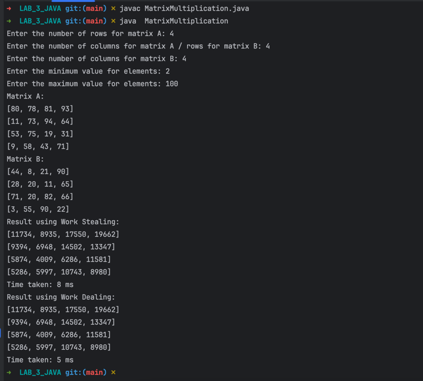

# Лабораторна робота: Множення матриць із використанням Fork/Join Framework

## Мета
Ознайомлення з підходами балансування задач у багатопотоковому середовищі. Розробка програмного забезпечення, яке реалізує підходи Work stealing та Work dealing для задачі множення матриць.

## Завдання
1. Написати програму для знаходження добутку двох матриць з використанням Fork/Join Framework.
2. Реалізувати підходи балансування задач:
   - **Work stealing**
   - **Work dealing**
3. Вивести результат обчислень та час виконання кожного підходу.

## Опис програми
Програма дозволяє користувачу задати:
- Розмірності матриць (кількість рядків і стовпців).
- Мінімальне та максимальне значення елементів матриці.

Після введення даних генеруються дві випадкові матриці, які виводяться на екран. Далі обчислюється добуток матриць двома способами:
1. **Work stealing** — з використанням `ForkJoinPool` і класу `RecursiveTask` для поділу задач на підзадачі.
2. **Work dealing** — з використанням `ExecutorService` і пулу потоків.

Програма також вимірює час виконання кожного з підходів.

## Як запустити програму
1. Завантажте код програми та відкрийте його у будь-якому середовищі розробки Java (наприклад, IntelliJ IDEA, Eclipse).
2. Переконайтеся, що встановлено JDK 11 або новішої версії.
3. Скомпілюйте програму.
   ```
   javac MatrixMultiplication.java
   ```
4. Запустіть програму.
   ```
   java MatrixMultiplication
   ```
5. Введіть необхідні параметри (розмірності матриць, мінімальні та максимальні значення елементів).
6. Дочекайтеся результату, який включає згенеровані матриці, результуючу матрицю та час виконання кожного з підходів.

## Порівняння підходів
### Work stealing
- Використовує адаптивне балансування задач між потоками.
- Забезпечує високу продуктивність на нерівномірно розподілених задачах.
- Здійснюється через `ForkJoinPool`.

### Work dealing
- Використовує розподілення задач між потоками на етапі їх створення.
- Простий в реалізації, але менш ефективний для задач із нерівномірним навантаженням.
- Реалізовано через `ExecutorService`.

## Результати тестування


## Висновки
- **Work stealing** підходить для задач із динамічним або нерівномірним розподілом навантаження.
- **Work dealing** доцільно використовувати для рівномірних задач, де розподіл навантаження можна передбачити заздалегідь.

У цьому проєкті обидва підходи були реалізовані для демонстрації їх особливостей і порівняння продуктивності.

